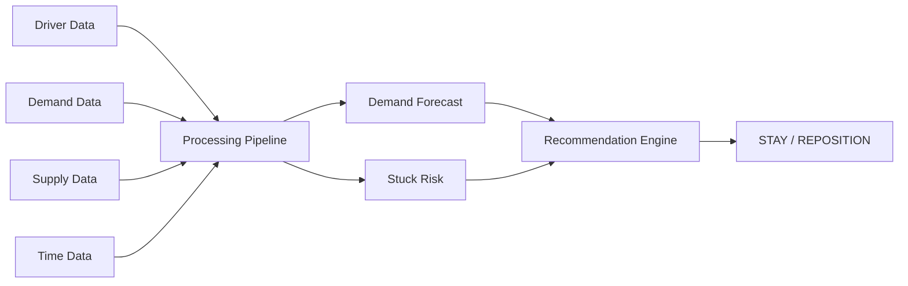

# 02 — Deep Dive Report: Phát hiện tài xế bị "kẹt" trong vùng nhu cầu thấp

> **Ngày tạo:** 2026-09-12  
> **Nguồn:** [Problem.md](file:///c:/Users/ADMIN/VinUni_Codelab_Day02/Problem.md)  
> **Trạng thái:** Deep Dive Analysis

---

## 1. Phân tích chi tiết bài toán

### 1.1. Bản chất vấn đề

Đây **không phải** bài toán đơn giản "tìm tài xế đang rảnh". Bài toán thực sự là:

> Xác định tài xế nào có **nguy cơ tiếp tục idle kéo dài**, và quyết định họ nên **chờ** hay **di chuyển** — có tính đến cả **lợi ích** và **chi phí** của mỗi lựa chọn.

### 1.2. Tại sao quy tắc đơn giản không đủ?

| Quy tắc đơn giản | Vấn đề |
|---|---|
| `Idle > 15 phút → di chuyển` | Không tính nhu cầu sắp tăng tại khu vực hiện tại |
| `Khu vực ít khách → di chuyển` | Không tính chi phí di chuyển, giao thông |
| `Đi tới khu vực nhu cầu cao nhất` | Nếu nhiều tài xế cùng đến → nhu cầu nhanh chóng bão hòa |
| `Luôn gợi ý di chuyển` | Chi phí chạy rỗng có thể lớn hơn lợi ích |

→ Cần hệ thống **thông minh hơn**, kết hợp nhiều yếu tố.

---

## 2. Phân tích 4 câu hỏi hệ thống

### 2.1. DETECT — Tài xế nào đang có nguy cơ?

**Input signals:**
- Idle duration (phút)
- Số yêu cầu đặt xe trong khu vực (demand density)
- Số tài xế rảnh trong khu vực (supply density)
- Tỷ lệ supply/demand

**Logic phát hiện:**

```
IF idle_time > threshold
   AND demand_density < low_threshold
   AND supply_density > high_threshold
   AND supply_demand_ratio > imbalance_threshold
THEN → flag driver as "at-risk"
```

**Lưu ý:** Threshold không nên cố định mà có thể điều chỉnh theo giờ, khu vực, ngày.

---

### 2.2. PREDICT — Xác suất tiếp tục idle?

**Mô hình dự đoán xác suất tài xế tiếp tục idle trong 10–15 phút tới.**

**Features đề xuất:**

| Feature | Loại | Mô tả |
|---------|------|-------|
| `idle_duration` | Numeric | Thời gian idle hiện tại (phút) |
| `current_demand` | Numeric | Số booking gần đây trong khu vực |
| `current_supply` | Numeric | Số tài xế rảnh trong khu vực |
| `supply_demand_ratio` | Numeric | Tỷ lệ cung/cầu |
| `hour_of_day` | Categorical | Giờ trong ngày (0–23) |
| `day_of_week` | Categorical | Thứ trong tuần (0–6) |
| `is_weekend` | Binary | Cuối tuần hay không |
| `is_holiday` | Binary | Ngày lễ hay không |
| `historical_demand_avg` | Numeric | Nhu cầu trung bình cùng khung giờ, cùng ngày |
| `distance_to_hotspot` | Numeric | Khoảng cách đến điểm nóng gần nhất |
| `area_type` | Categorical | Loại khu vực (sân bay, văn phòng, dân cư...) |

**Output:**
- `stuck_probability`: 0.0 → 1.0
- `risk_level`: LOW / MEDIUM / HIGH

**Mô hình gợi ý:** Gradient Boosting (XGBoost/LightGBM) hoặc Logistic Regression cho MVP.

---

### 2.3. DECIDE — Chờ hay di chuyển?

**Framework quyết định:**

```
expected_value_stay   = P(trip_at_current | stay) × avg_trip_value
expected_value_move   = P(trip_at_target | move) × avg_trip_value − cost_of_moving
```

```
IF expected_value_move > expected_value_stay + margin
   THEN → REPOSITION
   ELSE → STAY
```

**Cost of moving bao gồm:**
- Thời gian di chuyển (phút) × opportunity cost
- Quãng đường × chi phí nhiên liệu/pin
- Rủi ro nhu cầu giảm trước khi đến nơi

---

### 2.4. RECOMMEND — Di chuyển đến đâu?

**Với mỗi khu vực ứng viên, tính:**

```
score(area) = forecast_demand(area) × P(trip | area)
            − travel_cost(current → area)
            − congestion_penalty(area)
            − crowding_penalty(area)    // Bao nhiêu tài xế khác cũng đang di chuyển tới?
```

**Chọn khu vực có score cao nhất**, nếu score > threshold thì recommend REPOSITION, ngược lại STAY.

---

## 3. Kiến trúc AI Components

### 3.1. Demand Forecasting Model

| Hạng mục | Chi tiết |
|---|---|
| **Mục tiêu** | Dự báo số booking trong 15–30 phút tới theo khu vực |
| **Granularity** | Hexagonal grid (H3) hoặc zone-based |
| **Input** | Historical demand, time features, weather, events |
| **Output** | Predicted demand per zone per time slot |
| **Mô hình** | LSTM / Prophet / LightGBM |
| **Tần suất update** | Mỗi 5–10 phút |

### 3.2. Stuck Risk Prediction Model

| Hạng mục | Chi tiết |
|---|---|
| **Mục tiêu** | Xác suất tài xế tiếp tục idle trong 10–15 phút |
| **Input** | Driver features + zone features + time features |
| **Output** | stuck_probability (0–1), risk_level |
| **Mô hình** | XGBoost / LightGBM |
| **Evaluation** | Precision, Recall, F1 trên positive class (stuck) |

### 3.3. Reposition Recommendation Engine

| Hạng mục | Chi tiết |
|---|---|
| **Mục tiêu** | Đề xuất STAY hoặc MOVE TO zone X |
| **Input** | Stuck risk + demand forecast + travel cost + congestion |
| **Output** | Action (STAY/REPOSITION) + target zone + reasoning |
| **Approach** | Scoring function hoặc Contextual Bandit |
| **Evaluation** | Acceptance rate, success rate (nhận chuyến sau khi follow) |

---

## 4. Khi nào KHÔNG nên đề xuất di chuyển?

> [!IMPORTANT]
> Hệ thống phải tránh trở thành "luôn bảo tài xế di chuyển". Các edge case sau cần xử lý:

| Case | Điều kiện | Recommendation |
|------|-----------|----------------|
| **Nhu cầu sắp tăng** | Demand forecast tại khu vực hiện tại tăng mạnh trong 5–10 phút | **STAY** |
| **Khu vực thay thế quá xa** | Khoảng cách > 8 km hoặc travel time > 15 phút | **STAY** |
| **Giao thông ùn tắc** | Travel time tăng gấp đôi, nhu cầu có thể giảm trước khi đến | **STAY** hoặc tìm zone C |
| **Quá nhiều tài xế cùng di chuyển** | Số xe dự kiến tại target zone sẽ vượt nhu cầu | **STAY** hoặc zone khác |

---

## 5. Dữ liệu cần thiết

### 5.1. Dữ liệu bắt buộc (MVP)



| Nguồn dữ liệu | Trường dữ liệu |
|---|---|
| **Driver** | driver_id, lat/lng, status (online/offline, available/busy), idle_time, trip_history, location_history |
| **Demand** | booking_count, booking_time, pickup_location, completed_trips, cancelled_trips, customer_waiting_time |
| **Spatial** | zone distances, travel_time matrix, route data |
| **Temporal** | hour, day_of_week, is_weekend, is_holiday |

### 5.2. Dữ liệu bổ sung (Enhancement)

| Nguồn | Trường |
|---|---|
| **Weather** | temperature, rain, humidity |
| **Traffic** | real-time congestion, road incidents |
| **Events** | concerts, sports, festivals |
| **POI** | airports, malls, offices, schools |

---

## 6. Output mẫu của hệ thống

### Case: Driver A123

```json
{
  "driver_id": "A123",
  "current_area": "Area A",
  "idle_time_minutes": 23,
  "stuck_risk": "HIGH",
  "stuck_probability": 0.82,
  "current_demand": "LOW",
  "available_drivers_nearby": 38,
  "next_trip_probability_stay": 0.18,
  "recommendation": {
    "action": "REPOSITION",
    "target_area": "Area B",
    "distance_km": 2.3,
    "travel_time_minutes": 7,
    "forecast_demand": "HIGH",
    "next_trip_probability_move": 0.71,
    "reasoning": "Khả năng nhận chuyến tại vị trí hiện tại thấp trong 15 phút tới. Khu vực B có nhu cầu dự kiến cao hơn và nằm trong phạm vi di chuyển hợp lý."
  }
}
```

---

## 7. KPI đánh giá

### 7.1. KPI vận hành

| KPI | Mục tiêu | Đo lường |
|-----|----------|----------|
| Average idle time | ↓ Giảm | Trung bình phút idle trước khi nhận chuyến |
| Vehicle utilization | ↑ Tăng | % thời gian xe có khách / tổng thời gian online |
| Empty driving distance | ↓ Giảm | Km chạy rỗng trung bình / ngày |
| Customer waiting time | ↓ Giảm | Trung bình phút chờ từ booking đến pickup |
| Cancellation rate | ↓ Giảm | % chuyến bị hủy |
| Supply-demand imbalance | ↓ Giảm | Variance của supply/demand ratio giữa các zone |

### 7.2. KPI mô hình AI

| KPI | Mô hình | Đo lường |
|-----|---------|----------|
| Forecast accuracy | Demand Forecasting | MAE, RMSE trên predicted vs actual demand |
| Precision / Recall | Stuck Risk | Precision & Recall trên class "stuck" |
| Trip probability accuracy | Next-trip Prediction | Calibration curve, Brier score |
| Acceptance rate | Recommendation | % tài xế follow recommendation |
| Success rate | Recommendation | % tài xế nhận chuyến sau khi follow |

### 7.3. North Star Metric

> **Recommendation của AI có thực sự giúp giảm idle và cải thiện hiệu quả vận hành hay không?**

Đo bằng: So sánh **idle time** và **trip count** giữa nhóm follow recommendation vs. nhóm không follow (A/B test).

---

## 8. MVP đề xuất

### 8.1. Scope MVP

```
Input → Processing → Output
```

| Phase | Chi tiết |
|-------|----------|
| **Input** | Driver location, idle time, current demand, current supply, historical demand, time info |
| **Bước 1** | Xác định khu vực nhu cầu thấp |
| **Bước 2** | Tính stuck risk của tài xế |
| **Bước 3** | Dự báo nhu cầu 15–30 phút tới |
| **Bước 4** | Tìm khu vực lân cận |
| **Bước 5** | Ước tính lợi ích – chi phí di chuyển |
| **Bước 6** | Đưa ra recommendation |
| **Output** | `STAY` / `REPOSITION TO AREA B` / `REPOSITION TO AREA C` + lý do + metrics |

### 8.2. Tech Stack gợi ý

| Component | Công nghệ |
|---|---|
| Data pipeline | Apache Kafka + Flink (real-time) |
| Feature store | Redis / Feast |
| ML model | LightGBM (stuck risk), Prophet/LSTM (demand forecast) |
| Serving | FastAPI / gRPC |
| Monitoring | Grafana + Prometheus |
| A/B testing | In-house hoặc LaunchDarkly |

---

## 9. Rủi ro & Mitigation

| Rủi ro | Mức độ | Mitigation |
|--------|--------|------------|
| Tài xế không follow recommendation | 🟡 Trung bình | Gamification, incentive, UI/UX thân thiện |
| Dự báo nhu cầu sai | 🟡 Trung bình | Ensemble models, confidence intervals, fallback rules |
| Nhiều tài xế cùng đến một khu vực | 🔴 Cao | Global coordination, capacity-aware recommendation |
| Dữ liệu real-time lag | 🟡 Trung bình | Buffer, graceful degradation |
| Cold start (khu vực mới, giờ mới) | 🟡 Trung bình | Heuristic fallback, transfer learning |

---

## 10. Roadmap gợi ý

| Phase | Mốc | Nội dung |
|-------|-----|----------|
| **Phase 1** | MVP | Rule-based detect + simple demand forecast + basic recommendation |
| **Phase 2** | ML v1 | ML-based stuck risk + improved demand forecast + A/B test |
| **Phase 3** | Optimization | Global coordination + real-time traffic + contextual bandit |
| **Phase 4** | Scale | Multi-city deployment + auto-tuning + feedback loop |

---

> **Xem thêm:**  
> → [01-problem-scan.md](file:///c:/Users/ADMIN/VinUni_Codelab_Day02/01-problem-scan.md) — Tổng quan nhanh  
> → [03-ai-log.md](file:///c:/Users/ADMIN/VinUni_Codelab_Day02/03-ai-log.md) — Nhật ký phân tích AI  
> → [04-workflow-diagram.png](file:///c:/Users/ADMIN/VinUni_Codelab_Day02/04-workflow-diagram.png) — Sơ đồ luồng xử lý
